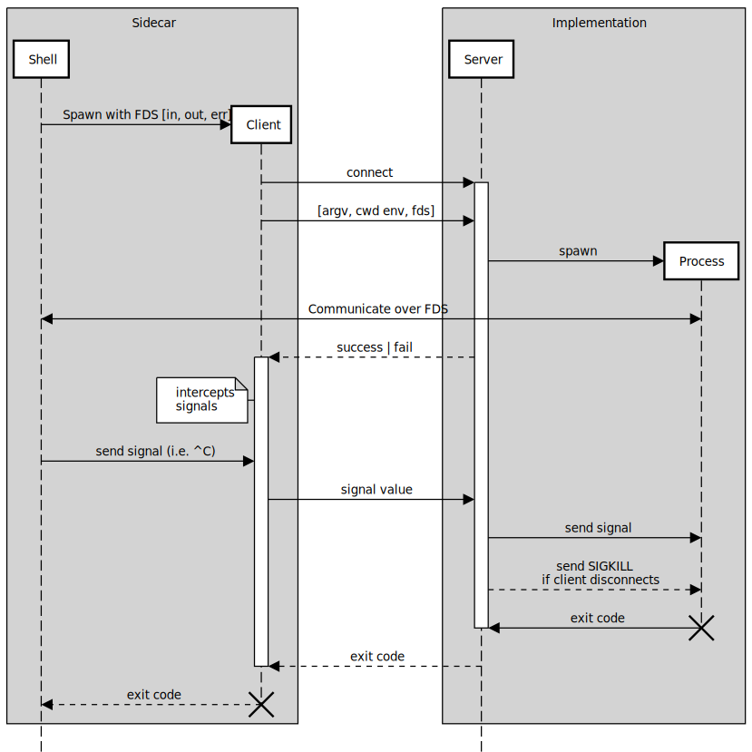

# Sidecar

Client-server tool to execute commands and pass standard streams over
unix domain socket.

## Purpose

Main usage is to invoke programs from one container, but execute them
in another container. Communication is based on shared volume that
will store the socket.

The application binary can be supplied through the volume too, keeping
the container that will start a server unchanged.

This implements work queue pattern from
[Design patterns for container-based distributed systems](https://static.googleusercontent.com/media/research.google.com/en//pubs/archive/45406.pdf)
Par 5.2

## Usage 

The tool can be used for seamless process start on connected
container. The process will receive standard streams from client
process, thus making execution completely transparent. Commands can be
piped without overhead. Interactive programs also work.

Using shims similar to this one simplify integration with tools that
expect certain scripts or executables to present locally. Keep in mind
that seamlessly passing workdir will work properly only if it happens
on a shared volume that is mounted to same location in both
containers.

```
#!/bin/sh 
exec /usr/local/bin/sidecar exec --connect /var/shared/sock --workdir "$(pwd)" -- "$(basename "$0")" "$@"
```


## Implementation

### Diagram



### Server
    1. creates SOCK_SEQPACKET unix domain socket on the shared volume and waits for connections
    2. expects [argv, env, cwd] request from the client as well as 3 standard stream descriptors
    3. spaws the process
    4. waits for signal values for the client, signals are passed to the child process
    5. returns exit code to the client when child process exits
    6. kills (-9) child process if client is disconnected prematurely
    
### Client
    1. connects to the socket
    2. send the request and own process standard stream file descriptors
    3. expects response with process start result: success or failure
    4. passes signals to the server when received
    5. expects exit code from the server


## Limitations

Signal passing is not possible for signals that can't be ignored: i.e.
SIGKILL, SIGSTOP, SIGSEGV.

Sending process to background breaks client terminal because shell job
control does not track sidecar processes, child process keeps running
and using client's standard streams without receiving SIGTTOU.

## License

This project is licensed under the [MIT license](LICENSE).
